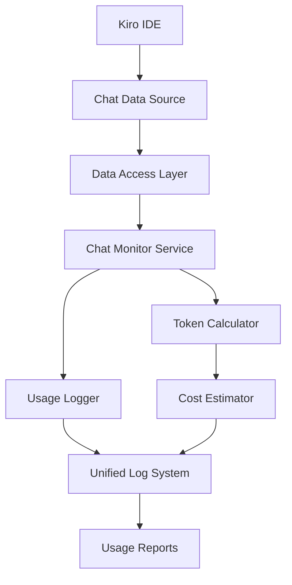

# Design Document

## Overview

本設計專注於解決 Token Monitor 無法監控 Kiro Chat 對話的核心問題。通過研究 Kiro IDE 的內部架構，建立能夠直接存取對話資料的監控機制，取代現有的檔案監控方案。設計採用多層次的資料存取策略，確保能夠可靠地獲取 Kiro Chat 的對話內容。

## Architecture

### 系統架構概覽



### 核心元件

1. **Chat Data Source** - Kiro IDE 的對話資料來源
2. **Data Access Layer** - 資料存取抽象層
3. **Chat Monitor Service** - 對話監控服務
4. **Token Calculator** - Token 計算引擎
5. **Usage Logger** - 使用量記錄器

## Components and Interfaces

### 1. Kiro Data Access Layer

**目的：** 提供統一的 Kiro 資料存取介面

```javascript
class KiroDataAccess {
    // 建立與 Kiro 的連接
    async connect() { }
    
    // 監聽對話事件
    onChatMessage(callback) { }
    
    // 獲取對話歷史
    async getChatHistory(sessionId) { }
    
    // 檢查連接狀態
    isConnected() { }
}
```

**資料存取策略：**
1. **Kiro API 整合** - 優先嘗試官方 API
2. **日誌檔案監控** - 監控 Kiro 的日誌檔案
3. **設定檔案分析** - 分析 Kiro 的設定和快取
4. **記憶體監控** - 監控 Kiro 程序的記憶體（最後手段）

### 2. Chat Monitor Service

**目的：** 核心的對話監控服務

```javascript
class ChatMonitorService {
    constructor(dataAccess, tokenCalculator, logger) {
        this.dataAccess = dataAccess;
        this.tokenCalculator = tokenCalculator;
        this.logger = logger;
    }
    
    // 開始監控
    async startMonitoring() { }
    
    // 處理對話訊息
    async handleChatMessage(message) { }
    
    // 停止監控
    async stopMonitoring() { }
}
```

**監控流程：**
1. 建立 Kiro 資料連接
2. 註冊對話事件監聽器
3. 即時處理對話訊息
4. 計算 Token 使用量
5. 記錄到統一日誌系統

### 3. Token Calculator

**目的：** 專門處理對話內容的 Token 計算

```javascript
class ChatTokenCalculator {
    // 計算對話 Token
    calculateChatTokens(userInput, aiResponse, model) {
        const inputTokens = this.estimateTokens(userInput);
        const outputTokens = this.estimateTokens(aiResponse);
        
        return {
            inputTokens,
            outputTokens,
            totalTokens: inputTokens + outputTokens,
            model,
            timestamp: new Date()
        };
    }
    
    // 估算 Token 數量
    estimateTokens(text) { }
    
    // 計算成本
    calculateCost(tokens, model) { }
}
```

## Data Models

### Chat Message Model

```javascript
const ChatMessage = {
    id: String,           // 訊息 ID
    sessionId: String,    // 對話會話 ID
    timestamp: Date,      // 時間戳記
    type: String,         // 'user' | 'assistant'
    content: String,      // 訊息內容
    tokens: Number,       // Token 數量
    model: String,        // 使用的 AI 模型
    cost: Number         // 估算成本
};
```

### Chat Session Model

```javascript
const ChatSession = {
    id: String,           // 會話 ID
    startTime: Date,      // 開始時間
    endTime: Date,        // 結束時間
    messages: Array,      // 訊息陣列
    totalTokens: Number,  // 總 Token 數
    totalCost: Number,    // 總成本
    model: String        // 主要使用的模型
};
```

### Usage Log Entry

```javascript
const UsageLogEntry = {
    timestamp: Date,      // 記錄時間
    source: 'kiro-chat', // 來源標識
    type: 'chat',        // 活動類型
    sessionId: String,   // 會話 ID
    inputTokens: Number, // 輸入 Token
    outputTokens: Number,// 輸出 Token
    totalTokens: Number, // 總 Token
    model: String,       // AI 模型
    cost: Number,        // 成本
    content: {           // 內容摘要
        userInput: String,    // 使用者輸入（前100字符）
        aiResponse: String    // AI 回應（前100字符）
    }
};
```

## Error Handling

### 連接失敗處理

```javascript
class ConnectionErrorHandler {
    async handleConnectionFailure(error) {
        console.warn('Kiro connection failed:', error.message);
        
        // 嘗試替代方案
        const alternatives = [
            () => this.tryLogFileAccess(),
            () => this.tryConfigFileAccess(),
            () => this.fallbackToFileMonitoring()
        ];
        
        for (const alternative of alternatives) {
            try {
                await alternative();
                return true;
            } catch (altError) {
                console.warn('Alternative failed:', altError.message);
            }
        }
        
        throw new Error('All Kiro access methods failed');
    }
}
```

### 資料完整性檢查

```javascript
class DataIntegrityChecker {
    validateChatMessage(message) {
        const required = ['content', 'timestamp', 'type'];
        const missing = required.filter(field => !message[field]);
        
        if (missing.length > 0) {
            throw new Error(`Missing required fields: ${missing.join(', ')}`);
        }
        
        return true;
    }
    
    validateTokenCalculation(tokens) {
        if (tokens < 0 || !Number.isInteger(tokens)) {
            throw new Error('Invalid token count');
        }
        return true;
    }
}
```

## Testing Strategy

### 1. Kiro 整合測試

**測試目標：** 驗證與 Kiro IDE 的連接和資料存取

```javascript
describe('Kiro Integration Tests', () => {
    test('should connect to Kiro IDE', async () => {
        const dataAccess = new KiroDataAccess();
        await expect(dataAccess.connect()).resolves.toBeTruthy();
    });
    
    test('should receive chat messages', async () => {
        const dataAccess = new KiroDataAccess();
        await dataAccess.connect();
        
        const messages = [];
        dataAccess.onChatMessage(msg => messages.push(msg));
        
        // 觸發測試對話
        await triggerTestChat();
        
        expect(messages.length).toBeGreaterThan(0);
    });
});
```

### 2. Token 計算測試

**測試目標：** 驗證對話內容的 Token 計算準確性

```javascript
describe('Chat Token Calculator Tests', () => {
    test('should calculate tokens for simple chat', () => {
        const calculator = new ChatTokenCalculator();
        const result = calculator.calculateChatTokens(
            'Hello, how are you?',
            'I am doing well, thank you for asking!',
            'claude-sonnet-4.0'
        );
        
        expect(result.inputTokens).toBeGreaterThan(0);
        expect(result.outputTokens).toBeGreaterThan(0);
        expect(result.totalTokens).toBe(result.inputTokens + result.outputTokens);
    });
});
```

### 3. 端到端測試

**測試目標：** 驗證完整的監控流程

```javascript
describe('End-to-End Chat Monitoring Tests', () => {
    test('should monitor complete chat session', async () => {
        const monitor = new ChatMonitorService(dataAccess, calculator, logger);
        await monitor.startMonitoring();
        
        // 模擬對話
        await simulateChatSession();
        
        // 驗證記錄
        const logs = await logger.getRecentLogs();
        expect(logs.some(log => log.source === 'kiro-chat')).toBeTruthy();
        
        await monitor.stopMonitoring();
    });
});
```

## Implementation Phases

### Phase 1: Kiro 資料存取研究
- 研究 Kiro IDE 的內部架構
- 探索可能的資料存取方式
- 建立概念驗證

### Phase 2: 基礎監控實作
- 實作 KiroDataAccess 類別
- 建立基本的對話監控
- 整合 Token 計算

### Phase 3: 系統整合
- 與現有監控系統整合
- 統一日誌格式
- 建立使用報告

### Phase 4: 測試和優化
- 完整的測試覆蓋
- 效能優化
- 錯誤處理改進

## Security and Privacy Considerations

### 資料隱私保護
- 只記錄 Token 統計，不儲存完整對話內容
- 提供內容摘要而非完整內容
- 支援敏感內容過濾

### 存取權限控制
- 確保只有授權的監控程序能存取 Kiro 資料
- 實作適當的錯誤處理避免資料洩露
- 提供使用者控制監控範圍的選項

## Performance Requirements

### 即時性要求
- 對話監控延遲 < 1 秒
- Token 計算時間 < 100ms
- 日誌記錄延遲 < 500ms

### 資源使用限制
- 記憶體使用 < 100MB
- CPU 使用率 < 5%
- 不影響 Kiro IDE 的正常運作