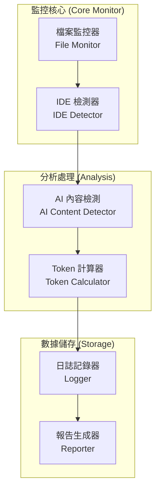

# Design Document

## Overview

簡化的通用 AI Token 監控系統，參考 Live LLM Token Counter 的設計理念，專注於核心功能：檢測 VS Code 和 Kiro IDE 中的 AI 活動，準確計算 Token 使用量。

系統採用輕量級設計，主要透過檔案監控和簡單的內容分析來識別 AI 互動，避免複雜的網路監控和程序注入。

## Architecture



## Components and Interfaces

### 1. 核心監控模組

#### FileSystemMonitor
```javascript
class FileSystemMonitor {
    constructor() {
        this.watchPaths = ['./**/*.{md,js,ts,py,txt}'];
        this.excludePaths = ['**/node_modules/**', '**/.git/**'];
    }
    
    start() { /* 監控檔案變化 */ }
    onFileChange(callback) { /* 檔案變化回調 */ }
}
```

#### IDEDetector
```javascript
class IDEDetector {
    detectCurrentIDE() {
        // 簡單檢測：透過程序名稱識別 IDE
        // 返回: 'vscode' | 'kiro' | 'unknown'
    }
    
    isAIRelatedFile(filePath, content) {
        // 檢測檔案是否包含 AI 生成的內容
        return this.hasAIPatterns(content);
    }
}
```

### 2. AI 內容檢測

#### AIContentDetector
```javascript
class AIContentDetector {
    detectAIContent(content, context) {
        // 簡單的 AI 內容檢測
        const patterns = [
            /\/\/ Generated by|\/\* Generated by/,  // 程式碼註解
            /```[\s\S]*```/,                        // Markdown 程式碼區塊
            /function.*{[\s\S]*}/                   // 函數定義
        ];
        
        return patterns.some(pattern => pattern.test(content));
    }
    
    classifyActivity(content) {
        // 簡單分類：coding, documentation, chat
        if (content.includes('function') || content.includes('class')) {
            return 'coding';
        }
        if (content.includes('#') || content.includes('##')) {
            return 'documentation';
        }
        return 'chat';
    }
}
```

### 3. Token 計算

#### TokenCalculator
```javascript
class TokenCalculator {
    calculateTokens(content) {
        // 簡化的 Token 計算（類似 Live LLM Token Counter）
        const chineseChars = (content.match(/[\u4e00-\u9fff]/g) || []).length;
        const englishChars = content.length - chineseChars;
        
        return Math.ceil(chineseChars / 1.5 + englishChars / 4);
    }
    
    calculateCost(tokens, model = 'gpt-4') {
        const pricing = {
            'gpt-4': { input: 0.03, output: 0.06 },
            'claude-3': { input: 0.003, output: 0.015 },
            'default': { input: 0.01, output: 0.02 }
        };
        
        const rate = pricing[model] || pricing.default;
        return tokens * rate.input / 1000; // 假設為輸入 token
    }
}
```

## Data Models

### 簡化的事件記錄
```javascript
{
    timestamp: "2025-08-01T10:30:00.000Z",
    ide: "vscode",
    activity_type: "coding",
    file_path: "src/main.js",
    content_length: 150,
    tokens: 38,
    cost_usd: 0.00038,
    model: "gpt-4"
}
```

### 基本配置
```javascript
{
    watch_paths: ["./**/*.{md,js,ts,py,txt}"],
    exclude_paths: ["**/node_modules/**", "**/.git/**"],
    log_file: "data/ai-usage.log",
    default_model: "gpt-4"
}
```

## Error Handling

### 簡單的錯誤處理
- 檔案監控失敗：記錄錯誤並繼續運行
- Token 計算錯誤：使用預設估算值
- 日誌寫入失敗：輸出到控制台

```javascript
class SimpleErrorHandler {
    handleError(error, operation) {
        console.error(`Error in ${operation}:`, error.message);
        // 繼續運行，不中斷監控
    }
}
```

## Testing Strategy

### 基本測試
- Token 計算準確性測試
- 檔案監控功能測試
- IDE 檢測測試

```javascript
// 簡單測試結構
describe('SimpleAIMonitor', () => {
    it('should calculate tokens correctly', () => {
        const calculator = new TokenCalculator();
        const tokens = calculator.calculateTokens('Hello world');
        expect(tokens).toBeGreaterThan(0);
    });
    
    it('should detect AI content', () => {
        const detector = new AIContentDetector();
        const isAI = detector.detectAIContent('function test() { return "hello"; }');
        expect(isAI).toBe(true);
    });
});
```

這個簡化的設計專注於核心功能，避免過度複雜化，更容易實作和維護。