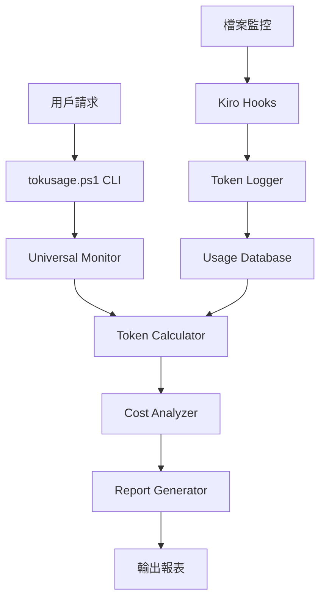

# TokenMonitor 系統架構

## 🏗️ 整體架構

## 📦 模組說明

### 🔧 核心腳本 (scripts/)
- **tokusage.ps1**: 主要 CLI 工具，提供類似 ccusage 的介面
- **universal-monitor.ps1**: 跨 IDE 通用監控腳本
- **universal-token-monitor.js**: JavaScript 監控核心

### 💻 原始碼 (src/)

#### JavaScript 模組 (src/js/)
- **enhanced-token-reporter.js**: 增強型報告生成器
- **professional-token-cli.js**: 專業 CLI 介面
- **token-monitor-integration.js**: 整合測試模組
- **test-token-monitoring.js**: 監控測試工具

#### Go 語言模組 (src/go/)
- **main.go**: Go 版本主程式
- **cmd/**: 命令行介面模組
- **internal/**: 內部核心邏輯
  - `analyzer/`: Token 分析器
  - `calculator/`: 成本計算器
  - `monitor/`: 監控服務
  - `reporter/`: 報告生成器

### 🧪 測試系統 (tests/)
- **reports/**: 測試報告檔案
- **data/**: 測試資料和觸發器

### 📊 資料層 (data/)
- **kiro-usage.log**: 使用記錄檔案

### ⚙️ Kiro 整合 (.kiro/)
- **hooks/**: Kiro IDE Hook 配置
- **settings/**: 設定檔案

## 🔄 資料流程

1. **監控階段**: 檔案變化 → Kiro Hooks → Token 計算 → 記錄儲存
2. **分析階段**: 讀取記錄 → 統計分析 → 成本計算
3. **報告階段**: 資料處理 → 格式化輸出 → 專業報表

## 🎯 設計原則

- **跨平台相容**: 支援 Windows/Linux/macOS
- **多 IDE 支援**: 不限於 Kiro IDE
- **即時監控**: 毫秒級檔案變化偵測
- **成本透明**: 詳細的 Token 和成本分析
- **擴展性**: 模組化設計，易於擴展